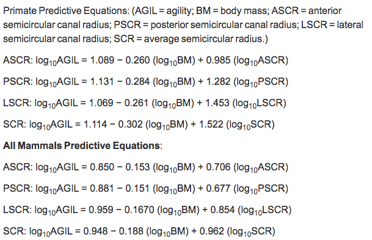
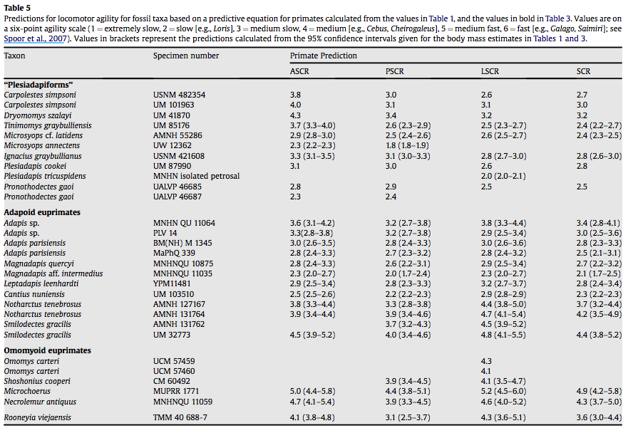
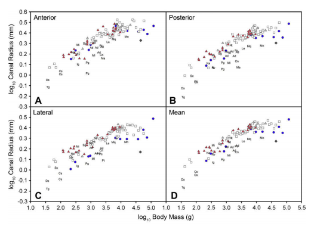

```{r setup, include=FALSE}
knitr::opts_chunk$set(
    echo = TRUE,
    warning = FALSE,
    comment = "##",
    prompt = TRUE,
    tidy = TRUE,
    tidy.opts = list(width.cutoff = 75),
    fig.path = "img/"
)
```
#Semicircular canal system in early primates
#2009
##Mary T Silcox, Jonathan I Bloch, Doug M Boyer, Marc Godinot, Timothy M Ryan, Fred Spoor, Alan Walker
###This paper examined the relationship between semicircular canal radius relative to locomotor agility across mammals. They then used the models generated through looking at these extant data to understand agility in fossil primates and plesiadapiforms. 
####They carried out this study by gathering data. Semicircular canal data came from Spoor et al. 2007 (for exant mammals and primates) and from inner ear endocasts of fossil primates generated through CT data. Body mass data came from Kay and Kirk 2000 (primates and mammals) and generated in this study for fossils. Agility Scores used here were based on Spoor et al 2007. 
####They log 10 transformed agility scores to use as the dependent variable and log 10 transformed body mass and log 10 transformed semicircular canal radii were the independent variables in each regression.
####They used Spoor et al. 2007's phylogenetic tree to run phylogenetic Generalized Least Squares Regressions (pgls) in the REGRESSIONv2.M program in Matlab.
####They ran 4 sets of pgls regressions: 1) the original branch length, 2) transformed branch length using maximum likelihood estimates for the Ornstein-uhlenbeck transform, 3)Grafen's rho, 4)Pagel's lambda. 
####Models were compared using the natural log of the maximum likelihood estimate and the Akaike information criterior.
####regressions were run using a set of 91 primate taxa and using a set of 210 mammalian taxa to determine primate-only vs all-mammal model differences. 
####Using predictive equations generated here, they estimated the agility score in 29 fossil stem/crown primates. 
###They also wanted to estimate body mass in fossils
####They used published predictive equations to estimate body mass in fossil primates preserving an upper 1st or 2nd molar.
####They also gathered data on skull length from Kay and Kirk 2000 to run least squares and Pgls regressions on the relationship between log 10 transformed skull length and log 10 transformed body mass. They did this by dividing taxa into those with more vertical or horizontal positional behaviors and ran independent regressions for each of these groups. They then used these models to estimate body mass in fossil stem/crown primates. 
###They looked at how agility score and each semicircular canal scaled relative to one another
####So they created double log plots of each log10transformed SCC against log10transformed body mass for mammals and primates - incorporating fossil stem/crown primates. They labeled extant taxa by agility category and fossil taxa directly on the plots

##Here:
###I will be carrying out 3 of the sets of pgls regressions run - 1)the original branch length, 2)the transformed branch length using maximum likelihood estimates for Grafen's rho, 3) the maximum likelihood estimates for Pagel's lambda. I attempted to run the Ornstein-Uhlenbeck transformation but was not able to produce a usable tree so it was excluded from this exercise. I will pull data from Silcox et al.2009 published either as supplementary data or directly in tables within the text.
###I will then predict agility scores in fossils based regressions using one of these branch transformations for each semicircular canal and the average semicircular canal radius. This will be in comparison to Table 5 within the publication.
###I will then plot extant primates and fossil stem/crown primates for each log10 transformed semicircular canal radius and log10 transformed body mass. Extant taxa will be labelled by agility category.
###They didn't really do any descriptive statistics but for the purpose of this assignment I'm going to use the describeBy() function in the beginning to get some descriptives of the orders within my data initally.

#to carry out Silcox et al 2009's stats I had to pull data from Silcox et al., 2009; Spoor et al. 2007; Kay and kirk, 2000; and Schulz, 1940. 


```{r read tree}
library(ape)
library(curl)
#reading in the tree from Spoor et al. 2007 used in Silcox et al. 2009

Tree<-read.tree(curl("https://raw.githubusercontent.com/ilundeen/data_reanalysis_assignment/master/spoor.tre"))
```
##Checking that it looks normal:
```{r}
plot(as.phylo(Tree), cex=0.5) 
```

##Checking that it looks **FUN**:
```{r}

plot(as.phylo(Tree), type="fan",cex=0.8, label.offset=0.2, edge.color=c("red","orange","yellow","green","forestgreen","aquamarine","deepskyblue","dodgerblue3","royalblue2","slateblue4","purple3","magenta4","maroon"), tip.color=c("red","orange","yellow","green","forestgreen","aquamarine","deepskyblue","dodgerblue3","royalblue2","slateblue4","purple3","magenta4","maroon"))


```

#now that the tree is read in correctly, it's time to read in the data from Silcox et al 2009 used to produce pgls regressions

```{r read data}
data<-read.csv(curl("https://raw.githubusercontent.com/ilundeen/data_reanalysis_assignment/master/silcox2009data.csv"), header=TRUE) 
```

#reading in the data that I used here
#this data set was downloaded as a supplementary file
```{r make tree and data comparable}
head(data) #checking to see if that data looks fine

library(psych) #psych package contains the describeBy function
describeBy(data,group=data$Order,mat=FALSE) #get descriptive statistics by Order of my dataset
detach("package:psych",unload=TRUE)
library(methods) #this is here because my computer kept giving me an error and this seemed to solve it. 
```
###There's a lot of NA because many of the predictions are specifically for primates - none of which are visible when looking at the first 6 species in the data set
```{r}
library(caper)
library(phytools)
library(geiger)
#little function to underline the taxa in my data to make it comparable to the taxa in the tree
underscore_it <- function (taxon_vector){
  require(stringr)
  taxon_vector <- str_replace(string= taxon_vector, pattern=" ", replacement="_")
  return(taxon_vector)
}
data$Species<-underscore_it(data$Species) #add in underscores to my data
#check for overlap between taxa in the tree and taxa in my data
row.names(data)<-data$Species #assigning species in my data as the comparable group to my tree
#checking for overlap in data
name.check(Tree,data)->overlap 
str(overlap) #check what is actually within that overlap value
overlap$data_not_tree #identify the specific taxa that are in the data but not located in the tree
overlap$tree_not_data #identify the species that are in the tree but not in the data

#this shows that there are a few species in my data that are slightly off in their formatting - so now I'll individually go through and rename them in my data set so that they'll match up with data in the Spoor et al.2007 tree that Silcox et al. 2009 used. 

data$Species[76]<-"Callicebus_moloch"
data$Species[80]<-"Cebus_apella"
data$Species[166]<-"Cryptomys_hottentotus_natalensis"
data$Species[94]<-"Eulemur_fulvus_ssp."
data$Species[116]<-"Lepilemur_sp."
data$Species[17]<-"Nyctereutes_procyonoideus_viverrinus"
data$Species[136]<-"Papio_hamadryas_ssp."
data$Species[32]<-"Pipistrellus_pipistrellus"
data$Species[12]<-"Puma/Felis_concolor"
data$Species[34]<-"Rhinolophus_cornutus_cornutus"
data$Species[145]<-"Saimiri_sciureus"
#now rechecking the names to make sure the names are formatted correctly. 
row.names(data)<-data$Species #assigning my species to my row names
name.check(Tree,data)->overlap #creates an overlap value
str(overlap) #list the species within overlap
#the only species that is not in the Silcox data set but IS in the spoor tree is the Tamandua so this line of code drops that from the tree
drop.tip(Tree, overlap$tree_not_data) -> my_tree
#now plot the tamandua-less tree.
plot(as.phylo(my_tree), cex=0.5, main="All Mammal Tree")
```


```{r All Mammal PGLS}
#PGLS Regressions
##First I will run PGLS regression on original branch lengths

#ALL MAMMAL
#using pgls in the "caper" package requires that I construct a comparative data set that matches tree data with my inputted data. I'll call this comparative data set "mammal" and refer to it in my pgls code
#phy=the phylogeny I'm using for this comparative data set; data=my data set; Species is the name of the column in my data frame is matched to tips in my phylogeny; vcv=TRUE means that I want to include a variance/covariance array for the phylogeny within my comparative data; na.omit=FALSE indicates that I do not want to reduce my phylogeny to only tips where there is variable data; warn.dropped=TRUE indicates that I do want R to tell me if there are tips that were dropped when I use this comparative data set
mammal <- comparative.data(phy=my_tree, data=data, Species, vcv = TRUE, na.omit = FALSE, warn.dropped = TRUE)
#the authors used log-10 transformed agility score, body mass, and semicircular canal radius to produce anterior, posterior, lateral, and average semicircular canal radius PGLS regressions. 

#regression for average semicircular canal radius using the original branch length and not a maximum likelihood branch length transformation 
avg<-pgls(log10(AGILITY2)~ log10(BM)+log10(SCR), data = mammal)
summary(avg)
#regression for lateral semicircular canal radius using the original branch length and not a maximum likelihood branch length transformation 
lat<-pgls(log10(AGILITY2)~ log10(BM)+log10(LSCR), data = mammal)
summary(lat)
#regression for posterior semicircular canal radius using the original branch length and not a maximum likelihood branch length transformation 
pos<-pgls(log10(AGILITY2)~ log10(BM)+log10(PSCR), data = mammal)
summary(pos)
#regression from anterior semicircular canal radius using the original branch length and not a maximum likelihood branch length transformation 
ant<-pgls(log10(AGILITY2)~ log10(BM)+log10(ASCR), data = mammal)
summary(ant)

#ALL PRIMATE
L = data$Order == "Primates" 
#pulls only data from the order primates out of the original data set and calls them "L"
pdata<-data[L,] 
#pulls out all the rows within "L" and names them their own primate-specific data set
name.check(Tree,pdata)->overlapP
#check for overlap between the Spoor tree and primate-specific data
str(overlapP)
#list the overlap in primate data and spoor tree
drop.tip(Tree, overlapP$tree_not_data) -> P_tree 
#drop all the data from the Spoor tree that isn't primate
plot(as.phylo(P_tree), cex=0.7, main="Primate-Only Tree")
#plot the primate tree to make sure it looks normal - it does. Carry on.
```

```{r Primate-Only PGLS}
#once again, I need to create that comparative data for primates that incorporates phylogeny and data - arguments are the same as the initial time I used the comparative.data function 
primate<- comparative.data(phy=P_tree, data=pdata, Species, vcv=TRUE, na.omit=FALSE, warn.dropped=TRUE)
#regression for average semicircular canal radius
pavg<-pgls(log10(AGILITY2)~ log10(BM)+log10(SCR), data = primate)
summary(pavg)
#regression for lateral semicircular canal radius
plat<-pgls(log10(AGILITY2)~ log10(BM)+log10(LSCR), data = primate)
summary(plat)
#regression for posterior semicircular canal radius
ppos<-pgls(log10(AGILITY2)~ log10(BM)+log10(PSCR), data = primate)
summary(ppos)
#regression from anterior semicircular canal radius 
pant<-pgls(log10(AGILITY2)~ log10(BM)+log10(ASCR), data = primate)
summary(pant)
#check to compare the equations generated by these regressions with those published in Silcox et al 2009. 
library(plyr)
untransformed = ldply(list(pant, ppos, plat, pavg, ant, pos, lat, avg), coefficients) #listing the coefficients of each of these regressions
attr(untransformed, "row.names")<- c("Primate-Only Anterior SCCR", "Primate-only Posterior SCCR", "Primate-only Lateral SCCR", "Primate-only Average SCCR","Mammal Anterior SCCR", "Mammal Posterior SCCR", "Mammal Lateral SCCR", "Mammal Average SCCR") #renaming the rows so that they reflect what regression was done
#renaming the rows to viewing these intercepts is more intuitive and in the same order as presented in the publication
untransformed
```




###Clearly these intercepts are not very close to those published in Silcox et al. 2009....This suggests either that I ran these regressions incorrectly or they transformed the branch length in the regressions that they ultimately used. 

##Next I will demonstrate why I didn't feel my Ornstein-Uhlenbeck transformation was useful.... 
```{r}
library(geiger)
#compute branch lengths if Ornstein-Uhlenbeck is used
my_treeOU<-rescale(my_tree, model="OU", alpha=1) #given that I wasn't sure what their alpha level was I didn't carry on with this set of PGLS regressions
plot(as.phylo(my_treeOU), cex=0.5, main="Mammal Ornstein-Uhlenbeck Branch Length Transformation = Garbage")
```


 
#Grafen branch length transformation
```{r}
my_treegraf<-compute.brlen(my_tree, method="Grafen")
plot(as.phylo(my_treegraf), cex=0.5, main="Mammal Grafen's Rho Branch Length Transformation")

#code here follows what I did for the normal branch lengths
#ALL MAMMAL
GRmammal <- comparative.data(phy=my_treegraf, data=data, Species, vcv = TRUE, na.omit = FALSE, warn.dropped = TRUE)
#regression for average semicircular canal radius
avgGR<-pgls(log10(AGILITY2)~ log10(BM)+log10(SCR), data = GRmammal, lambda='ML')
summary(avgGR)
#regression for lateral semicircular canal radius
latGR<-pgls(log10(AGILITY2)~ log10(BM)+log10(LSCR), data = GRmammal, lambda='ML')
summary(latGR)
#regression for posterior semicircular canal radius
posGR<-pgls(log10(AGILITY2)~ log10(BM)+log10(PSCR), data = GRmammal, lambda='ML')
summary(posGR)
#regression from anterior semicircular canal radius 
antGR<-pgls(log10(AGILITY2)~ log10(BM)+log10(ASCR), data = GRmammal, lambda='ML')
summary(antGR)


#ALL PRIMATE
P_treeGR<-compute.brlen(P_tree, method="Grafen")
plot(as.phylo(P_treeGR), cex=0.7, main="Primate-Only Grafen's Rho Branch Length Transformation")
#generate my comparative data for my PGLS regressions specific to this OU tree and the primate group
GRprimate<- comparative.data(phy=P_treeGR, data=pdata, Species, vcv=TRUE, na.omit=FALSE, warn.dropped=TRUE)
#regression for average semicircular canal radius 
pavgGR<-pgls(log10(AGILITY2)~ log10(BM)+log10(SCR), data = GRprimate, lambda='ML')
summary(pavgGR)
#regression for lateral semicircular canal radius
platGR<-pgls(log10(AGILITY2)~ log10(BM)+log10(LSCR), data = GRprimate, lambda='ML')
summary(platGR)
#regression for posterior semicircular canal radius
pposGR<-pgls(log10(AGILITY2)~ log10(BM)+log10(PSCR), data = GRprimate, lambda='ML')
summary(pposGR)
#regression from anterior semicircular canal radius 
pantGR<-pgls(log10(AGILITY2)~ log10(BM)+log10(ASCR), data = GRprimate, lambda='ML')
summary(pantGR)

GrafenEquations = ldply(list(pantGR, pposGR, platGR, pavgGR, antGR, posGR, latGR, avgGR), coefficients)
attr(GrafenEquations, "row.names")<- c("Primate-Only Anterior SCCR", "Primate-only Posterior SCCR", "Primate-only Lateral SCCR", "Primate-only Average SCCR","Mammal Anterior SCCR", "Mammal Posterior SCCR", "Mammal Lateral SCCR", "Mammal Average SCCR") #renaming the rows to viewing these intercepts is more intuitive and in the same order as presented in the publication
GrafenEquations

```


##look at pgls regressions the 
#Pagel's Lambda branch length transformation
```{r}

my_treepagel <-rescale(my_tree, model="lambda", lambda=1)
plot(as.phylo(my_treepagel), cex=0.5, main="Mammal Pagel's Lambda Branch Length Transformation")

#ALL MAMMAL
PAmammal <- comparative.data(phy=my_treepagel, data=data, Species, vcv = TRUE, na.omit = FALSE, warn.dropped = TRUE)
#regression for average semicircular canal radius
avgPA<-pgls(log10(AGILITY2)~ log10(BM)+log10(SCR), data = PAmammal, lambda='ML')
summary(avgPA)
#regression for lateral semicircular canal radius
latPA<-pgls(log10(AGILITY2)~ log10(BM)+log10(LSCR), data = PAmammal, lambda='ML')
summary(latPA)
#regression for posterior semicircular canal radius
posPA<-pgls(log10(AGILITY2)~ log10(BM)+log10(PSCR), data = PAmammal, lambda='ML')
summary(posPA)
#regression from anterior semicircular canal radius 
antPA<-pgls(log10(AGILITY2)~ log10(BM)+log10(ASCR), data = PAmammal, lambda='ML')
summary(antPA)
#ALL PRIMATE
P_treePA<-rescale(P_tree, model="lambda", lambda=1)
plot(as.phylo(P_treePA), cex=0.7, main="Primate-Only Pagel's Lambda Branch Length Transformation")
#generate my comparative data for my PGLS regressions specific to this OU tree and the primate group
PAprimate<- comparative.data(phy=P_treePA, data=pdata, Species, vcv=TRUE, na.omit=FALSE, warn.dropped=TRUE)
#regression for average semicircular canal radius 
pavgPA<-pgls(log10(AGILITY2)~ log10(BM)+log10(SCR), data = PAprimate, lambda='ML')
summary(pavgPA)
#regression for lateral semicircular canal radius
platPA<-pgls(log10(AGILITY2)~ log10(BM)+log10(LSCR), data = PAprimate, lambda='ML')
summary(platPA)
#regression for posterior semicircular canal radius
pposPA<-pgls(log10(AGILITY2)~ log10(BM)+log10(PSCR), data = PAprimate, lambda='ML')
summary(pposPA)
#regression from anterior semicircular canal radius 
pantPA<-pgls(log10(AGILITY2)~ log10(BM)+log10(ASCR), data = PAprimate, lambda='ML')
summary(pantPA)


PagelEquations = ldply(list(pantPA, pposPA, platPA, pavgPA, antPA, posPA, latPA, avgPA), coefficients)
attr(PagelEquations, "row.names")<- c("Primate-Only Anterior SCCR", "Primate-only Posterior SCCR", "Primate-only Lateral SCCR", "Primate-only Average SCCR","Mammal Anterior SCCR", "Mammal Posterior SCCR", "Mammal Lateral SCCR", "Mammal Average SCCR") #renaming the rows to viewing these intercepts is more intuitive and in the same order as presented in the publication
PagelEquations

```
#compare the equations generated above
```{r}
avg_SCC_equations= ldply(list(avg, avgGR, avgPA, pavg, pavgGR, pavgPA), coefficients) #list all the coefficients of my equations to compare with predictive equations in Silcox
attr(avg_SCC_equations, "row.names")<- c("Normal", "Grafen's Rho", "Pagel's Lambda","Primate-only Normal", "Primate-only Grafen's Rho", "Primate-only Pagel's Lambda") #rename all of the rows so that they reflect which pgls regression model was used

lat_SCC_equations= ldply(list(lat, latGR, latPA, plat, platGR, platPA), coefficients)
attr(lat_SCC_equations, "row.names")<- c("Normal", "Grafen's Rho", "Pagel's Lambda","Primate-only Normal", "Primate-only Grafen's Rho", "Primate-only Pagel's Lambda")

pos_SCC_equations= ldply(list(pos, posGR, posPA, ppos, pposGR, pposPA), coefficients)
attr(pos_SCC_equations, "row.names")<- c("Normal", "Grafen's Rho", "Pagel's Lambda","Primate-only Normal", "Primate-only Grafen's Rho", "Primate-only Pagel's Lambda")

ant_SCC_equations= ldply(list(ant, antGR, antPA, pant, pantGR, pantPA), coefficients)
attr(ant_SCC_equations, "row.names")<- c("Normal", "Grafen's Rho", "Pagel's Lambda","Primate-only Normal", "Primate-only Grafen's Rho", "Primate-only Pagel's Lambda")
```

#Reminder: Silcox et al 2009 Average Semicircular canal radius predictive equations:
##Mammals:
##Log~10~(agility score) = 0.948 - 0.188 (Log~10~ (BodyMass))+ 0.962 (Log~10~ (Average Semicircular Canal Radius))
##Primates: 
##Log~10~(agility score) = 1.114 - 0.302 (Log~10~ (BodyMass))+ 1.522 (Log~10~ (Average Semicircular Canal Radius))

```{r Avgerage SCC}
avg_SCC_equations

```

#Reminder: Silcox et al 2009 Lateral Semicircular canal radius predictive equations:
##Mammals:
##Log~10~ (agility score) = 0.959 - 0.1670 (Log~10~  (BodyMass))+ 0.854 (Log~10~ (Lateral Semicircular Canal Radius))
##Primates: 
##Log~10~ (agility score) = 1.069 - 0.261 (Log~10~  (BodyMass))+ 1.453 (Log~10~ (Lateral Semicircular Canal Radius))

```{r Lateral SCC}
lat_SCC_equations

```

#Reminder: Silcox et al 2009 Posterior Semicircular canal radius predictive equations:
##Primates: 
##Log~10~ (agility score) = 1.131 - 0.284 (Log~10~  (BodyMass))+ 1.282 (Log~10~ (Average Semicircular Canal Radius))
##Mammals:
##Log~10~ (agility score) = 0.881 - 0.151 (Log~10~  (BodyMass))+ 0.677 (Log~10~ (Average Semicircular Canal Radius))

```{r Posterior SCC}
pos_SCC_equations

```

#Reminder: Silcox et al 2009 Anterior Semicircular canal radius predictive equations:
##Primates: 
##Log~10~ (agility score) = 1.089 - 0.260 (Log~10~  (BodyMass))+ 0.985 (Log~10~ (Average Semicircular Canal Radius))
##Mammals:
##Log~10~ (agility score) = 0.850 - 0.153 (Log~10~  (BodyMass))+ 0.706 (Log~10~ (Average Semicircular Canal Radius))

```{r anterior SCC}
ant_SCC_equations

```

## Unfortunatley, I was not able to directly replicate the predictive equations produced by Silcox et al 2009 though it was close in a few of the Pagel's Lambda and Grafen's Rho transformation regression models. 


```{r Predicting fossil body mass}
#predicting body mass in fossils!
#Given that I wasn't able to replicate the predictive equations that the authors used to estimate agility scores, I will use Pagel's Lambda models for each canal for  the primate-only equations to generate 4 different agility predictions. 
fossil<-read.csv(curl("https://raw.githubusercontent.com/ilundeen/data_reanalysis_assignment/master/fossilscc.csv"), header=TRUE) #reading in the fossil data from my github
prim.avg.pred <- 10^(predict(pavgPA, newdata = data.frame(SCR= fossil$SC.R, BM=fossil$BM))) #predicting agility index based on average semicircular canal radius using the pgls regression model w/pagel's lambda branch length transformation

prim.lat.pred <- 10^(predict(platPA, newdata = data.frame(LSCR= fossil$LSC.R, BM=fossil$BM)))#predicting agility index based on average semicircular canal radius using the pgls regression model w/pagel's lambda branch length transformation

prim.ant.pred <- 10^(predict(pantPA, newdata = data.frame(ASCR= fossil$ASC.R, BM=fossil$BM)))#predicting agility index based on average semicircular canal radius using the pgls regression model w/pagel's lambda branch length transformation

prim.pos.pred <- 10^(predict(pposPA, newdata = data.frame(PSCR= fossil$PSC.R, BM=fossil$BM)))#predicting agility index based on average semicircular canal radius using the pgls regression model w/pagel's lambda branch length transformation

Agility_predictions<-cbind(prim.ant.pred, prim.pos.pred, prim.lat.pred, prim.avg.pred) #binding all of the predictions together by column 
rownames(Agility_predictions)<- c("Carpolestes simpsoni", "C. simpsoni", "Dryomomys szalayi", "Tinimomys graybulliensis", "Microsyops cf. latidens", "M. annectens", "Ignacius graybullianus", "Plesiadapis cookei", "P. tricuspidens", "Pronothodectes gaoi","P. gaoi", "Adapis sp.", "Adapis sp.", "A. parisiensis", "A. parisiensis", "Magnadapis quercyi", "M. aff. intermedius", "Leptadapis leenhardti", "Cantius nuniensis", "Notharctus tenebrosus", "N. tenebrosus", "Smilodectes gracilis", "S. gracilis", "Omomys carteri", "O. carteri", "Shoshonius cooperi", "Microchoerus", "Necrolemur antiquus", "Rooneyia viejaensis") #renaming each row to species names 
colnames(Agility_predictions)<-c("Anterior SCC","Posterior SCC", "Lateral SCC", "Average SCC" ) #renaming the columns so they reflect which SCC was used to generate this prediciton
Agility_predictions #show the final compilation of predicted agility scores. 


```
##Side Note interpretation of these results - 
### agility score increases with speed (1=slow=loris and 6=fast=Galago)
### these agiliity scores - which are actually quite close to those predicted in Table 5 of Silcox et al 2009 - indicate that there was a variety of speeds in plesiadapiforms and euprimates. Omomyoid primates had the highest agility scores predicted here indicating that they moved faster than other fossil taxa here. 



```{r Coverting Data to use in ggplot}
#read in ggplot so I can recreate the graphs
library(ggplot2)

#messing with my dataframes now so I can combine them..... 
#pull in certain sets of data from the 2 CSV files I read in earlier:
df<-pdata[ , c(1,6,8,9,10,11,5)] #pull in subset of primate data file, i.e. only the columns that are needed to plot with my fossil data
ff<-fossil[ , c(1,2,4,5,6,7,8)] #pull in subset of fossil file....only the columns needed to plot data
names(df)[names(df)=="AGILITY"]<-"abrev" #rename agility in all mammal data to be comparable with fossil data
names(ff)[names(ff)=="ASC.R"]<-"ASCR" #rename fossil SCC measurements
names(ff)[names(ff)=="PSC.R"]<-"PSCR" #rename fossil SCC measurements
names(ff)[names(ff)=="LSC.R"]<-"LSCR" #rename fossil SCC measurements
names(ff)[names(ff)=="SC.R"]<-"SCR" #rename fossil SCC measurements
td<-rbind(df,ff) #bind the two subsetted and now comparable datasets together

labelthese<-c("Cs","Tg","Ml","Ma","Ig","Pc","Pt","Pg","Ad","Mq","Mn","Le","Cn","Nt","Sg","Oc","Sc","Mi","Na","Rv") #indicate which things I want to be labelled on their own - in this case it is the fossils included here
td[td==0] <- NA #change all the zeros in my data set to NAs so that they won't be plotted as values along the x-axis

#convert my dataframe to a long format so ggplot can work with it more easily
td$Species<-factor(td$Species) #make sure that my Species colum is listed as the factor
td<-td[c("Species", "abrev", "BM", "ASCR", "PSCR", "LSCR", "SCR")] #reorder my data frame so I can convert it properly
library(tidyr) #read in the appropriate package to make this all work nicely
tdL<-gather(td, measurement, SCC, ASCR:SCR, factor_key=TRUE ) #use the gather function to call my "td" data set
#retain the species name, abreviation, and body mass of each individual but list in individual rows the values for the anterior, posterior, lateral, and average SCC radius
```

```{r Recreated Plots}
SCC_Plots <- ggplot(tdL, aes(x=log10(BM), y=log10(SCC))) + #using my data tdl, I will plot log body mass on the x axis and log semicircular canal radius on the y axis 
  geom_point(aes(shape = tdL$abrev, colour = tdL$abrev))+ #specify that I want my points to show up sorted by "abrev" in shape and color
        theme_bw(13) + #using the black and white theme with specified text size
  scale_shape_manual(values=c(23,24,0,24,21,6,32,32,32,32,32,32,32,32,32,32,32,32,32,32,32,32,32,32,32,32,32))+ #manually set what kind of shapes I want everything to have - fossils have no shape
  scale_color_manual(values=c("blue", "red", "forestgreen", "purple3", "slateblue", "magenta","black", "black","black","black","black","black","black","black","black","black","black","black","black","black","black","black","black","black","black","black","black"))+ #specify what color I want everything to be
  geom_text(aes(label=abrev), color="black", data=subset(tdL, abrev %in% labelthese)) #specify that I want all the fossils labeled directly on the plot
canal<-c("ASCR" = "Anterior SCC", "PSCR"="Posterior SCC", "LSCR"="Lateral SCC", "SCR"="Average SCC") #specifying what each canal plot should be labelled as
SCC_Plots <-SCC_Plots + facet_wrap(~measurement, ncol=2, labeller=as_labeller(canal)) #use the facet wrap function to specify that I want each SCC measurement to be on a different plot but that I want them to all share a legend/scale and be in 2 columns; Also specifying that I want them labelled as I specifiied in the previous line of code
SCC_Plots<-SCC_Plots + labs(title="Logarithmic Plots of Semicircular \n Canal Radius on Body Mass", x="Log10 Body Mass (g)", y="Log10 Canal Radius (mm)") #add a title and x/y-axis labels 
SCC_Plots
```


###My plots are showing the same data as those shown in Silcox et al because I wasn't predicting body mass here 
