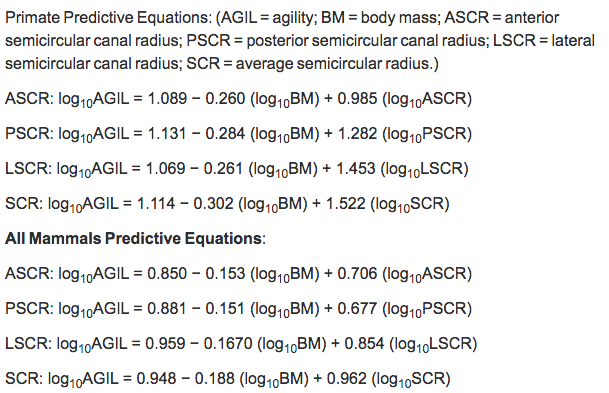
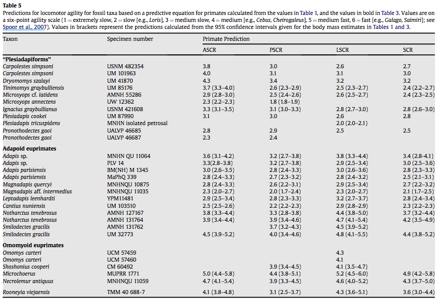
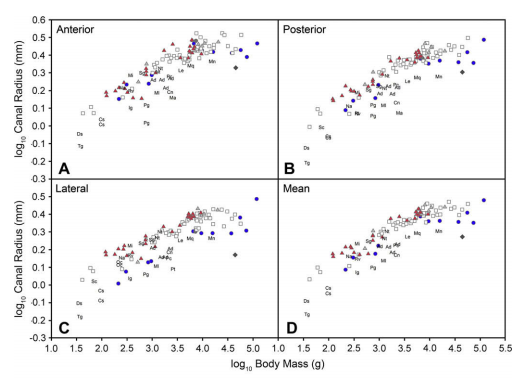

```{r}
knitr::opts_chunk$set(
    echo = TRUE,
    warning = FALSE,
    comment = "##",
    prompt = TRUE,
    tidy = TRUE,
    tidy.opts = list(width.cutoff = 75),
    fig.path = "img/"
)
```
DESCRIPTION OF WHAT THE PAPER ACTUALLY DID

#to carry out Silcox et al 2009's stats I had to pull data from Silcox et al., 2009; Spoor et al. 2007; Kay and kirk, 2000; and Schulz, 1940. 


```{r}
library(ape)
library(curl)
#reading in the tree from Spoor et al. 2007 used in Silcox et al. 2009

Tree<-read.tree(curl("https://raw.githubusercontent.com/ilundeen/data_reanalysis_assignment/master/spoor.tre"))

plot(Tree) #checking that it looks normal
```

#now that the tree is read in correctly, it's time to read in the data from Silcox et al 2009 used to produce pgls regressions

```{r}
data<-read.csv(curl("https://raw.githubusercontent.com/ilundeen/data_reanalysis_assignment/master/silcox2009data.csv"), header=TRUE) #reading in the data that I used here
#this data set was downloaded as a supplementary file
str(data) #checking to see if that data looks fine
library(caper)
library(phytools)
library(geiger)
#little function to underline the taxa in my data to make it comparable to the taxa in the tree
underscore_it <- function (taxon_vector){
  require(stringr)
  taxon_vector <- str_replace(string= taxon_vector, pattern=" ", replacement="_")
  return(taxon_vector)
}
data$Species<-underscore_it(data$Species) #add in underscores to my data
#check for overlap between taxa in the tree and taxa in my data
row.names(data)<-data$Species #assigning species in my data as the comparable group to my tree
#checking for overlap in data
name.check(Tree,data)->overlap 
str(overlap) #check what is actually within that overlap value
overlap$data_not_tree #identify the specific taxa that are in the data but not located in the tree
overlap$tree_not_data #identify the species that are in the tree but not in the data

#this shows that there are a few species in my data that are slightly off in their formatting - so now I'll individually go through and rename them in my data set so that they'll match up with data in the Spoor et al.2007 tree that Silcox et al. 2009 used. 

data$Species[76]<-"Callicebus_moloch"
data$Species[80]<-"Cebus_apella"
data$Species[166]<-"Cryptomys_hottentotus_natalensis"
data$Species[94]<-"Eulemur_fulvus_ssp."
data$Species[116]<-"Lepilemur_sp."
data$Species[17]<-"Nyctereutes_procyonoideus_viverrinus"
data$Species[136]<-"Papio_hamadryas_ssp."
data$Species[32]<-"Pipistrellus_pipistrellus"
data$Species[12]<-"Puma/Felis_concolor"
data$Species[34]<-"Rhinolophus_cornutus_cornutus"
data$Species[145]<-"Saimiri_sciureus"
#now rechecking the names to make sure the names are formatted correctly. 
row.names(data)<-data$Species
name.check(Tree,data)->overlap
str(overlap) #list the species within overlap
drop.tip(Tree, overlap$tree_not_data) -> my_tree #the only species that is not in the Silcox data set but IS in the spoor tree is the Tamandua so this line of code drops that from the tree
plot(my_tree) #now plot the tamandua-less tree.
```
#PGLS Regressions carried out in this study
## The authors ran 4 sets of PGLS regressions:
###THE FIRST used the original branch lengths of the phylogeny to examine the relationship between variables.
#### I carried these out below 
###THE SECOND used the Ornstein-Uhlenbeck transformation 
#### I wasn't able to produce a usable tree under this branch-length transformational model so I excluded this from my data reanalysis assignment. This may have been due to the fact that they didn't publish the alpha level that they used so I don't have enough information to replicate this transformation perfectly. 
###THE THIRD used the Grafen's branch-length transformation
#### I carried these out below
###THE FOURTH used the Pagel's branch-length transformation
#### I carried these out below
##First I will run PGLS regression on original branch lengths
```{r}
#ALL MAMMAL
#using pgls in the "caper" package requires that I construct a comparative data set that matches tree data with my inputted data. I'll call this comparative data set "mammal" and refer to it in my pgls code
#phy=the phylogeny I'm using for this comparative data set; data=my data set; Species is the name of the column in my data frame is matched to tips in my phylogeny; vcv=TRUE means that I want to include a variance/covariance array for the phylogeny within my comparative data; na.omit=FALSE indicates that I do not want to reduce my phylogeny to only tips where there is variable data; warn.dropped=TRUE indicates that I do want R to tell me if there are tips that were dropped when I use this comparative data set
mammal <- comparative.data(phy=my_tree, data=data, Species, vcv = TRUE, na.omit = FALSE, warn.dropped = TRUE)
#the authors used log-10 transformed agility score, body mass, and semicircular canal radius to produce anterior, posterior, lateral, and average semicircular canal radius PGLS regressions. 

#regression for average semicircular canal radius using the original branch length and not a maximum likelihood branch length transformation 
avg<-pgls(log10(AGILITY2)~ log10(BM)+log10(SCR), data = mammal)
summary(avg)
#regression for lateral semicircular canal radius using the original branch length and not a maximum likelihood branch length transformation 
lat<-pgls(log10(AGILITY2)~ log10(BM)+log10(LSCR), data = mammal)
summary(lat)
#regression for posterior semicircular canal radius using the original branch length and not a maximum likelihood branch length transformation 
pos<-pgls(log10(AGILITY2)~ log10(BM)+log10(PSCR), data = mammal)
summary(pos)
#regression from anterior semicircular canal radius using the original branch length and not a maximum likelihood branch length transformation 
ant<-pgls(log10(AGILITY2)~ log10(BM)+log10(ASCR), data = mammal)
summary(ant)

#ALL PRIMATE
L = data$Order == "Primates" #pulls only data from the order primates out of the original data set and calls them "L"
pdata<-data[L,] #pulls out all the rows within "L" and names them their own primate-specific data set
name.check(Tree,pdata)->overlapP #check for overlap between the Spoor tree and primate-specific data
str(overlapP) #list the overlap in primate data and spoor tree
drop.tip(Tree, overlapP$tree_not_data) -> P_tree  #drop all the data from the Spoor tree that isn't primate
plot(P_tree) #plot the primate tree to make sure it looks normal - it does. Carry on.
```

```{r}
#once again, I need to create that comparative data for primates that incorporates phylogeny and data - arguments are the same as the initial time I used the comparative.data function 
primate<- comparative.data(phy=P_tree, data=pdata, Species, vcv=TRUE, na.omit=FALSE, warn.dropped=TRUE)
#regression for average semicircular canal radius
pavg<-pgls(log10(AGILITY2)~ log10(BM)+log10(SCR), data = primate)
summary(pavg)

#regression for lateral semicircular canal radius
plat<-pgls(log10(AGILITY2)~ log10(BM)+log10(LSCR), data = primate)
summary(plat)
#regression for posterior semicircular canal radius
ppos<-pgls(log10(AGILITY2)~ log10(BM)+log10(PSCR), data = primate)
summary(ppos)
#regression from anterior semicircular canal radius 
pant<-pgls(log10(AGILITY2)~ log10(BM)+log10(ASCR), data = primate)
summary(pant)

#check to compare the equations generated by these regressions with those published in Silcox et al 2009. 
library(plyr)
untransformed = ldply(list(pant, ppos, plat, pavg, ant, pos, lat, avg), coefficients)
attr(untransformed, "row.names")<- c("Primate-Only Anterior SCCR", "Primate-only Posterior SCCR", "Primate-only Lateral SCCR", "Primate-only Average SCCR","Mammal Anterior SCCR", "Mammal Posterior SCCR", "Mammal Lateral SCCR", "Mammal Average SCCR") #renaming the rows to viewing these intercepts is more intuitive and in the same order as presented in the publication
untransformed



```
##Clearly these intercepts are not very close to those published in Silcox et al. 2009....This suggests either that I ran these regressions incorrectly or they transformed the branch length in the regressions that they ultimately used. 

##Next I will look at branch lengths using Ornstein-Uhlenbeck branch transformation and subsequent PGSL regressions
```{r}
library(geiger)
#compute branch lengths if Ornstein-Uhlenbeck is used
my_treeOU<-rescale(my_tree, model="OU", alpha=1) #given that I wasn't sure what their alpha level was I didn't carry on with this set of PGLS regressions
plot(my_treeOU)

#plus the tree produced here looks uninformative and crazy. 


```
#look at pgls regressions using the Grafen branch length transformation
```{r}
my_treegraf<-compute.brlen(my_tree, method="Grafen")
plot(my_treegraf)

#code here follows what I did for the normal branch lengths
#ALL MAMMAL
GRmammal <- comparative.data(phy=my_treegraf, data=data, Species, vcv = TRUE, na.omit = FALSE, warn.dropped = TRUE)
#regression for average semicircular canal radius
avgGR<-pgls(log10(AGILITY2)~ log10(BM)+log10(SCR), data = GRmammal, lambda='ML')
summary(avgGR)
#regression for lateral semicircular canal radius
latGR<-pgls(log10(AGILITY2)~ log10(BM)+log10(LSCR), data = GRmammal, lambda='ML')
summary(latGR)
#regression for posterior semicircular canal radius
posGR<-pgls(log10(AGILITY2)~ log10(BM)+log10(PSCR), data = GRmammal, lambda='ML')
summary(posGR)
#regression from anterior semicircular canal radius 
antGR<-pgls(log10(AGILITY2)~ log10(BM)+log10(ASCR), data = GRmammal, lambda='ML')
summary(antGR)


#ALL PRIMATE
P_treeGR<-compute.brlen(P_tree, method="Grafen")
plot(P_treeGR)
#generate my comparative data for my PGLS regressions specific to this OU tree and the primate group
GRprimate<- comparative.data(phy=P_treeGR, data=pdata, Species, vcv=TRUE, na.omit=FALSE, warn.dropped=TRUE)
#regression for average semicircular canal radius 
pavgGR<-pgls(log10(AGILITY2)~ log10(BM)+log10(SCR), data = GRprimate, lambda='ML')
summary(pavgGR)
#regression for lateral semicircular canal radius
platGR<-pgls(log10(AGILITY2)~ log10(BM)+log10(LSCR), data = GRprimate, lambda='ML')
summary(platGR)
#regression for posterior semicircular canal radius
pposGR<-pgls(log10(AGILITY2)~ log10(BM)+log10(PSCR), data = GRprimate, lambda='ML')
summary(pposGR)
#regression from anterior semicircular canal radius 
pantGR<-pgls(log10(AGILITY2)~ log10(BM)+log10(ASCR), data = GRprimate, lambda='ML')
summary(pantGR)

GrafenEquations = ldply(list(pantGR, pposGR, platGR, pavgGR, antGR, posGR, latGR, avgGR), coefficients)
attr(GrafenEquations, "row.names")<- c("Primate-Only Anterior SCCR", "Primate-only Posterior SCCR", "Primate-only Lateral SCCR", "Primate-only Average SCCR","Mammal Anterior SCCR", "Mammal Posterior SCCR", "Mammal Lateral SCCR", "Mammal Average SCCR") #renaming the rows to viewing these intercepts is more intuitive and in the same order as presented in the publication
GrafenEquations

```


#look at pgls regressions the Pagel's Lambda branch length transformation
```{r}

my_treepagel <-rescale(my_tree, model="lambda", lambda=1)
plot(my_treepagel)

#ALL MAMMAL
PAmammal <- comparative.data(phy=my_treepagel, data=data, Species, vcv = TRUE, na.omit = FALSE, warn.dropped = TRUE)
#regression for average semicircular canal radius
avgPA<-pgls(log10(AGILITY2)~ log10(BM)+log10(SCR), data = PAmammal, lambda='ML')
summary(avgPA)
#regression for lateral semicircular canal radius
latPA<-pgls(log10(AGILITY2)~ log10(BM)+log10(LSCR), data = PAmammal, lambda='ML')
summary(latPA)
#regression for posterior semicircular canal radius
posPA<-pgls(log10(AGILITY2)~ log10(BM)+log10(PSCR), data = PAmammal, lambda='ML')
summary(posPA)
#regression from anterior semicircular canal radius 
antPA<-pgls(log10(AGILITY2)~ log10(BM)+log10(ASCR), data = PAmammal, lambda='ML')
summary(antPA)
#ALL PRIMATE
P_treePA<-rescale(P_tree, model="lambda", lambda=1)
plot(P_treePA)
#generate my comparative data for my PGLS regressions specific to this OU tree and the primate group
PAprimate<- comparative.data(phy=P_treePA, data=pdata, Species, vcv=TRUE, na.omit=FALSE, warn.dropped=TRUE)
#regression for average semicircular canal radius 
pavgPA<-pgls(log10(AGILITY2)~ log10(BM)+log10(SCR), data = PAprimate, lambda='ML')
summary(pavgPA)
#regression for lateral semicircular canal radius
platPA<-pgls(log10(AGILITY2)~ log10(BM)+log10(LSCR), data = PAprimate, lambda='ML')
summary(platPA)
#regression for posterior semicircular canal radius
pposPA<-pgls(log10(AGILITY2)~ log10(BM)+log10(PSCR), data = PAprimate, lambda='ML')
summary(pposPA)
#regression from anterior semicircular canal radius 
pantPA<-pgls(log10(AGILITY2)~ log10(BM)+log10(ASCR), data = PAprimate, lambda='ML')
summary(pantPA)


PagelEquations = ldply(list(pantPA, pposPA, platPA, pavgPA, antPA, posPA, latPA, avgPA), coefficients)
attr(PagelEquations, "row.names")<- c("Primate-Only Anterior SCCR", "Primate-only Posterior SCCR", "Primate-only Lateral SCCR", "Primate-only Average SCCR","Mammal Anterior SCCR", "Mammal Posterior SCCR", "Mammal Lateral SCCR", "Mammal Average SCCR") #renaming the rows to viewing these intercepts is more intuitive and in the same order as presented in the publication
PagelEquations

```
#compare the equations generated above
```{r}
avg_SCC_equations= ldply(list(avg, avgGR, avgPA, pavg, pavgGR, pavgPA), coefficients)
attr(avg_SCC_equations, "row.names")<- c("Normal", "Grafen's Rho", "Pagel's Lambda","Primate-only Normal", "Primate-only Grafen's Rho", "Primate-only Pagel's Lambda")

lat_SCC_equations= ldply(list(lat, latGR, latPA, plat, platGR, platPA), coefficients)
attr(lat_SCC_equations, "row.names")<- c("Normal", "Grafen's Rho", "Pagel's Lambda","Primate-only Normal", "Primate-only Grafen's Rho", "Primate-only Pagel's Lambda")

pos_SCC_equations= ldply(list(pos, posGR, posPA, ppos, pposGR, pposPA), coefficients)
attr(pos_SCC_equations, "row.names")<- c("Normal", "Grafen's Rho", "Pagel's Lambda","Primate-only Normal", "Primate-only Grafen's Rho", "Primate-only Pagel's Lambda")

ant_SCC_equations= ldply(list(ant, antGR, antPA, pant, pantGR, pantPA), coefficients)
attr(ant_SCC_equations, "row.names")<- c("Normal", "Grafen's Rho", "Pagel's Lambda","Primate-only Normal", "Primate-only Grafen's Rho", "Primate-only Pagel's Lambda")
```

#Reminder: Silcox et al 2009 Average Semicircular canal radius predictive equations:
##Mammals:
##Log10(agility score) = 0.948 - 0.188 (Log10 (BodyMass))+ 0.962 (Log10(Average Semicircular Canal Radius))
##Primates: 
##Log10(agility score) = 1.114 - 0.302 (Log10 (BodyMass))+ 1.522 (Log10(Average Semicircular Canal Radius))

```{r}
avg_SCC_equations

```

#Reminder: Silcox et al 2009 Lateral Semicircular canal radius predictive equations:
##Mammals:
##Log10(agility score) = 0.959 - 0.1670 (Log10 (BodyMass))+ 0.854 (Log10(Lateral Semicircular Canal Radius))
##Primates: 
##Log10(agility score) = 1.069 - 0.261 (Log10 (BodyMass))+ 1.453 (Log10(Lateral Semicircular Canal Radius))

```{r}
lat_SCC_equations

```

#Reminder: Silcox et al 2009 Posterior Semicircular canal radius predictive equations:
##Primates: 
##Log10(agility score) = 1.131 - 0.284 (Log10 (BodyMass))+ 1.282 (Log10(Average Semicircular Canal Radius))
##Mammals:
##Log10(agility score) = 0.881 - 0.151 (Log10 (BodyMass))+ 0.677 (Log10(Average Semicircular Canal Radius))

```{r}
pos_SCC_equations


```

#Reminder: Silcox et al 2009 Anterior Semicircular canal radius predictive equations:
##Primates: 
##Log10(agility score) = 1.089 - 0.260 (Log10 (BodyMass))+ 0.985 (Log10(Average Semicircular Canal Radius))
##Mammals:
##Log10(agility score) = 0.850 - 0.153 (Log10 (BodyMass))+ 0.706 (Log10(Average Semicircular Canal Radius))

```{r}
ant_SCC_equations


```

## Unfortunatley, I was not able to directly replicate the predictive equations produced by Silcox et al 2009 though it was close in a few of the Pagel's Lambda and Grafen's Rho transformation regression models. 


```{r}
#predicting body mass in fossils!
#Given that I wasn't able to replicate the predictive equations that the authors used to estimate agility scores, I will use Pagel's Lambda models for each canal for  the primate-only equations to generate 4 different agility predictions. 
fossil<-read.csv(curl("https://raw.githubusercontent.com/ilundeen/data_reanalysis_assignment/master/fossilscc.csv"), header=TRUE) #reading in the fossil data from my github
prim.avg.pred <- 10^(predict(pavgPA, newdata = data.frame(SCR= fossil$SC.R, BM=fossil$BM))) #predicting agility index based on average semicircular canal radius using the pgls regression model w/pagel's lambda branch length transformation

prim.lat.pred <- 10^(predict(platPA, newdata = data.frame(LSCR= fossil$LSC.R, BM=fossil$BM)))#predicting agility index based on average semicircular canal radius using the pgls regression model w/pagel's lambda branch length transformation

prim.ant.pred <- 10^(predict(pantPA, newdata = data.frame(ASCR= fossil$ASC.R, BM=fossil$BM)))#predicting agility index based on average semicircular canal radius using the pgls regression model w/pagel's lambda branch length transformation

prim.pos.pred <- 10^(predict(pposPA, newdata = data.frame(PSCR= fossil$PSC.R, BM=fossil$BM)))#predicting agility index based on average semicircular canal radius using the pgls regression model w/pagel's lambda branch length transformation

Agility_predictions<-cbind(prim.ant.pred, prim.pos.pred, prim.lat.pred, prim.avg.pred) #binding all of the predictions together by column 
rownames(Agility_predictions)<- c("Carpolestes simpsoni", "C. simpsoni", "Dryomomys szalayi", "Tinimomys graybulliensis", "Microsyops cf. latidens", "M. annectens", "Ignacius graybullianus", "Plesiadapis cookei", "P. tricuspidens", "Pronothodectes gaoi","P. gaoi", "Adapis sp.", "Adapis sp.", "A. parisiensis", "A. parisiensis", "Magnadapis quercyi", "M. aff. intermedius", "Leptadapis leenhardti", "Cantius nuniensis", "Notharctus tenebrosus", "N. tenebrosus", "Smilodectes gracilis", "S. gracilis", "Omomys carteri", "O. carteri", "Shoshonius cooperi", "Microchoerus", "Necrolemur antiquus", "Rooneyia viejaensis") #renaming each row to species names 
colnames(Agility_predictions)<-c("Anterior SCC","Posterior SCC", "Lateral SCC", "Average SCC" ) #renaming the columns so they reflect which SCC was used to generate this prediciton
Agility_predictions #show the final compilation of predicted agility scores. 



```
##Side Note interpretation of these results - 
### agility score increases with speed (1=slow=loris and 6=fast=Galago)
### these agiliity scores - which are actually quite close to those predicted in Table 5 of Silcox et al 2009 - indicate that there was a variety of speeds in plesiadapiforms and euprimates. Omomyoid primates had the highest agility scores predicted here indicating that they moved faster than other fossil taxa here. 


```{r}
#read in ggplot so I can recreate the graphs
library(ggplot2)

#pull in certain sets of data from the 2 CSV files I read in earlier:
df<-data[ , c(1,6,8,9,10,11,5)] #pull in subset of all-mammal file
ff<-fossil[ , c(1,2,4,5,6,7,8)] #pull in subset of fossil file
names(df)[names(df)=="AGILITY"]<-"abrev" #rename agility in all mammal data to be comparable with fossil data
names(ff)[names(ff)=="ASC.R"]<-"ASCR" #rename fossil SCC measurements
names(ff)[names(ff)=="PSC.R"]<-"PSCR" #rename fossil SCC measurements
names(ff)[names(ff)=="LSC.R"]<-"LSCR" #rename fossil SCC measurements
names(ff)[names(ff)=="SC.R"]<-"SCR" #rename fossil SCC measurements
td<-rbind(df,ff) #bind the two subsetted and now comparable datasets together

labelthese<-c("Cs","Tg","Ml","Ma","Ig","Pc","Pt","Pg","Ad","Mq","Mn","Le","Cn","Nt","Sg","Oc","Sc","Mi","Na","Rv") #indicate which things I want to be labelled on their own - in this case it is the fossils included here

mamlat <- ggplot(data = td, aes(x = log10(BM), y = log10(LSCR)))+geom_point(aes(shape = td$abrev, colour = td$abrev))+ #indicate what to plot and what should be represented by points on my graphs and how these should be grouped 
  scale_shape_manual(values=c(16,23,24,0,24,21,21,46,46,46,46,46,46,46,46,46,46,46,46,46,46,46,46,46,46,46,46,46,46))+ #manually set the shape values
  scale_color_manual(values=c("black", "gray50", "red", "black", "gray50", "gray60","mediumblue", "black","black","black","black","black","black","black","black","black","black","black","black","black","black","black","black","black","black","black","black"))+ #manually set the colors for each of these groups
  xlab("Log10 Body Mass") + #manually set the x-axis label
  ylab("Log10 Semicircular Canal Radius") + #manual set the y-axis label
  annotate("text", y= max(log10(td$LSCR)), x =min((log10(td$BM))),label="Lateral",hjust=0) + #add in a title at the far corner of the plot
  theme(legend.position="none")
mamlat<-mamlat + geom_text(aes(label=abrev), color="black", data=subset(td, abrev %in% labelthese))

mamant <- ggplot(data = td, aes(x = log10(BM), y = log10(ASCR)))+geom_point(aes(shape = td$abrev, colour = td$abrev))+
  scale_shape_manual(values=c(16,23,24,0,24,21,21,46,46,46,46,46,46,46,46,46,46,46,46,46,46,46,46,46,46,46,46,46,46))+
  scale_color_manual(values=c("black", "gray50", "red", "black", "gray50", "gray60","mediumblue", "black","black","black","black","black","black","black","black","black","black","black","black","black","black","black","black","black","black","black","black"))+
  xlab("Log10 Body Mass") + 
  ylab("Log10 Semicircular Canal Radius") +
  annotate("text", y= max(log10(td$ASCR)), x =min((log10(td$BM))),label="Anterior",hjust=0) +
  theme(legend.position="none")
mamant<-mamant + geom_text(aes(label=abrev), color="black", data=subset(td, abrev %in% labelthese))
mampost <- ggplot(data = td, aes(x = log10(BM), y = log10(PSCR)))+geom_point(aes(shape = td$abrev, colour = td$abrev))+
  scale_shape_manual(values=c(16,23,24,0,24,21,21,46,46,46,46,46,46,46,46,46,46,46,46,46,46,46,46,46,46,46,46,46,46))+
  scale_color_manual(values=c("black", "gray50", "red", "black", "gray50", "gray60","mediumblue", "black","black","black","black","black","black","black","black","black","black","black","black","black","black","black","black","black","black","black","black"))+
  xlab("Log10 Body Mass") + 
  ylab("Log10 Semicircular Canal Radius") +
  annotate("text", y= max(log10(td$PSCR)), x =min((log10(td$BM))),label="Posterior",hjust=0) +
  theme(legend.position="none")
mampost<-mampost + geom_text(aes(label=abrev), color="black", data=subset(td, abrev %in% labelthese))
mammean <- ggplot(data = td, aes(x = log10(BM), y = log10(SCR)))+geom_point(aes(shape = td$abrev, colour = td$abrev))+
 scale_shape_manual(values=c(16,23,24,0,24,21,21,46,46,46,46,46,46,46,46,46,46,46,46,46,46,46,46,46,46,46,46,46,46))+
  scale_color_manual(values=c("black", "gray50", "red", "black", "gray50", "gray60","mediumblue", "black","black","black","black","black","black","black","black","black","black","black","black","black","black","black","black","black","black","black","black"))+
  xlab("Log10 Body Mass") + 
  ylab("Log10 Semicircular Canal Radius") +
 annotate("text", y= max(log10(td$SCR)), x =min((log10(td$BM))),label="Mean",hjust=0) +
  theme(legend.position="none")
mammean<-mammean + geom_text(aes(label=abrev), color="black", data=subset(td, abrev %in% labelthese))

#plot all 4 plots side by side
library(gridExtra)
library(grid)

#function for arranging the 4 graphs so that they are all next to one another and share a legend 
grid_arrange_shared_legend <- function(..., nrow = 1, ncol = length(list(...)), position = c("bottom", "right")) {
  plots <- list(...)
  position <- match.arg(position)
  g <- ggplotGrob(plots[[1]] + theme(legend.position = position))$grobs
  legend <- g[[which(sapply(g, function(x) x$name) == "guide-box")]]
  lheight <- sum(legend$height)
  lwidth <- sum(legend$width)
  gl <- lapply(plots, function(x) x + theme(legend.position = "none"))
  gl <- c(gl, nrow = nrow, ncol = ncol)
  combined <- switch(position,
                     "bottom" = arrangeGrob(do.call(arrangeGrob, gl),
                            legend,
                            ncol = 1,
                            heights = unit.c(unit(1, "npc") - lheight, lheight)),
                     "right" = arrangeGrob(do.call(arrangeGrob, gl),
                            legend,
                           ncol = 2,
                          widths = unit.c(unit(1, "npc") - lwidth, lwidth)))
  grid.newpage()
  grid.draw(combined)
}

#viewing the final plots together with a common key
grid_arrange_shared_legend(mamant, mampost, mamlat, mammean, ncol=2, nrow=2)


```

```{r}

```


